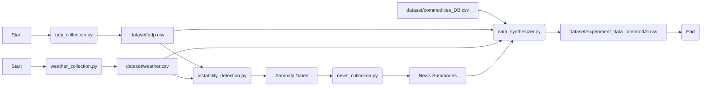

# Data Collection Pipeline Instructions

This document outlines the data collection pipeline for the commodAI project. The pipeline consists of several steps, each handled by a separate Python script.

## Data Flow

The data flows through the pipeline in the following order:

1.  **GDP Data Collection (`gdp_collection.py`):**
    *   Fetches GDP data from the FRED API using the `FRED_API_KEY` stored in the `.env` file.
    *   Saves the data to `dataset/gdp.csv`.

2.  **Weather Data Collection (`weather_collection.py`):**
    *   Fetches weather data (TMIN, TMAX, PRCP) from the NOAA API using the `NOAA_TOKEN` stored in the `.env` file.
    *   Determines the nearest weather station based on provided latitude and longitude.
    *   Saves the data to `dataset/weather.csv`.

3.  **Instability Detection (`instability_detection.py`):**
    *   Detects anomalies in the GDP data (`dataset/gdp.csv`) and weather data (`dataset/weather.csv`).
    *   Uses both Isolation Forest and Moving Average methods for anomaly detection.
    *   Identifies periods of instability (anomalies).

4.  **News Data Collection and Summarization (`news_collection.py`):**
    *   Fetches news articles from the GDELT API for the identified instability periods.
    *   Uses the Google Gemini API (`GOOGLE_API_KEY` in `.env`) to summarize the news articles, focusing on market instability, economic downturns, and commodity price fluctuations.

5.  **Data Synthesis (`data_synthesizer.py`):**
    *   Combines data from `dataset/commodities_DB.csv`, `dataset/gdp.csv`, and `dataset/weather.csv`.
    *   Integrates the news summaries from `news_collection.py` for the anomaly periods.
    *   Saves the final combined dataset to `dataset/experiment_data_commodAI.csv`.

## Markdown Flow Diagram



## Running the Pipeline

Before running the pipeline, ensure you have a `.env` file in the root directory with the following environment variables set:

*   `FRED_API_KEY`: Your FRED API key.
*   `NOAA_TOKEN`: Your NOAA API token.
*   `GOOGLE_API_KEY`: Your Google Gemini API key.

To run the pipeline, execute the following commands in your terminal, in this order:

```bash
python data_collection/gdp_collection.py
python data_collection/weather_collection.py
python data_collection/data_synthesizer.py
```

Alternatively, you can run the entire pipeline from the `commodAI.ipynb` Jupyter Notebook.